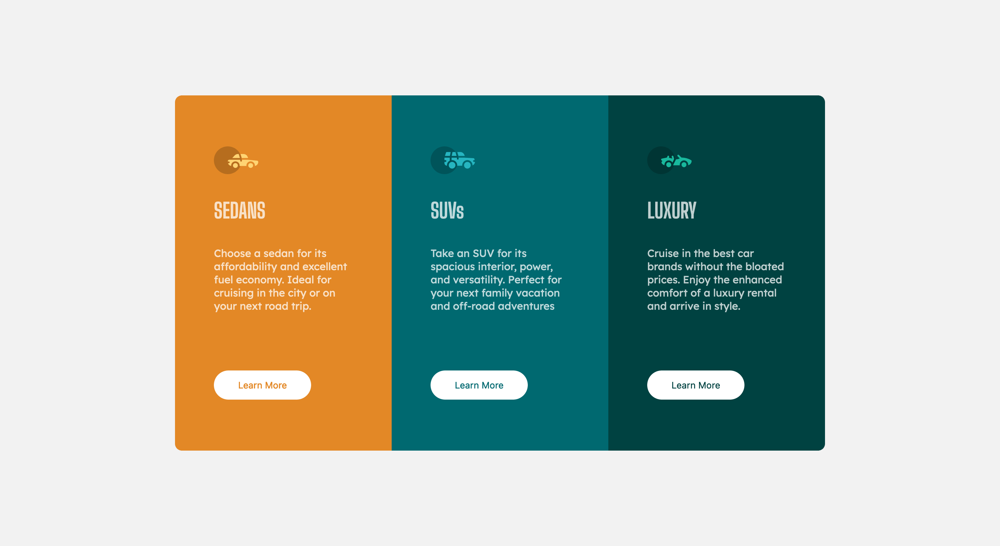

# Frontend Mentor - 3-column preview card component solution

This is a solution to the [3-column preview card component challenge on Frontend Mentor](https://www.frontendmentor.io/challenges/3column-preview-card-component-pH92eAR2-). Frontend Mentor challenges help you improve your coding skills by building realistic projects. 

## Table of contents

- [Overview](#overview)
  - [The challenge](#the-challenge)
  - [Screenshot](#screenshot)
  - [Links](#links)
- [My process](#my-process)
  - [Built with](#built-with)
  - [What I learned](#what-i-learned)
  - [Continued development](#continued-development)
- [Author](#author)

## Overview

### The challenge

Users should be able to:

- View the optimal layout depending on their device's screen size
- See hover states for interactive elements

### Screenshot

### Links

- Solution URL: [In GitHub](https://github.com/abv4594/frontend-speedrun/tree/main/docs/3-column-preview-card-component)
- Live Site URL: [In GitHub Pages](https://abv4594.github.io/frontend-speedrun/3-column-preview-card-component/index.html)

## My process

### Built with

- Semantic HTML5 markup
- CSS custom properties
- Flexbox
- CSS Grid

### What I learned

One of the insights I had while building this design is how to rationalize about body and containers, which hold the elements.

To see how you can add code snippets, see below:

### Continued development

Continue to explore other designs to master how all the subject of lengths (heigh and width).

## Author

- My gitHub page - [abv4594](https://github.com/abv4594)
